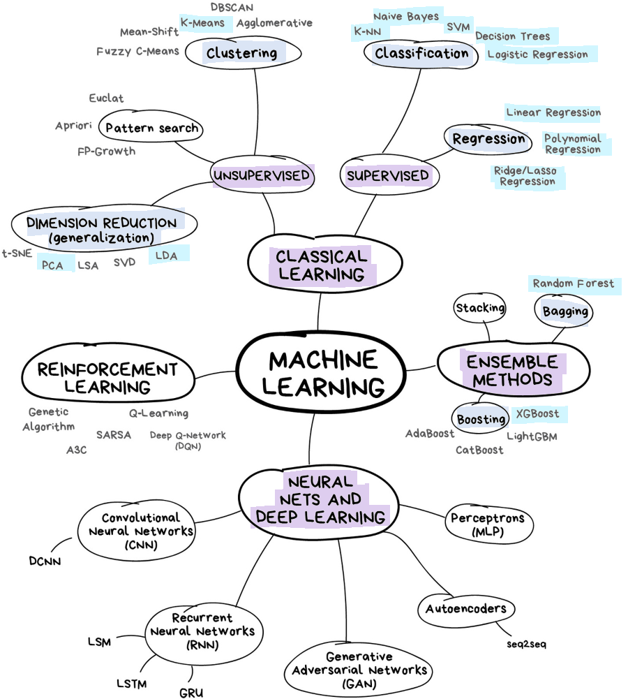

Welcome to my Machine Learning Crash Course! 

In this series, I will attempt to explain fundamental concepts in machine learning to you in understandable terms that are also not oversimplified. 

I am definitely not an expert in the field, just a student who has really enjoyed learning about this area. My coding journey started quite late, only a bit more than half a year ago, when I entered the second semester of my first year at university. So if you are also just starting out, believe that you can and will get better at it, so long as the passion is there. 

The first post is simply just an overview of what I will be covering in this crash course. 

