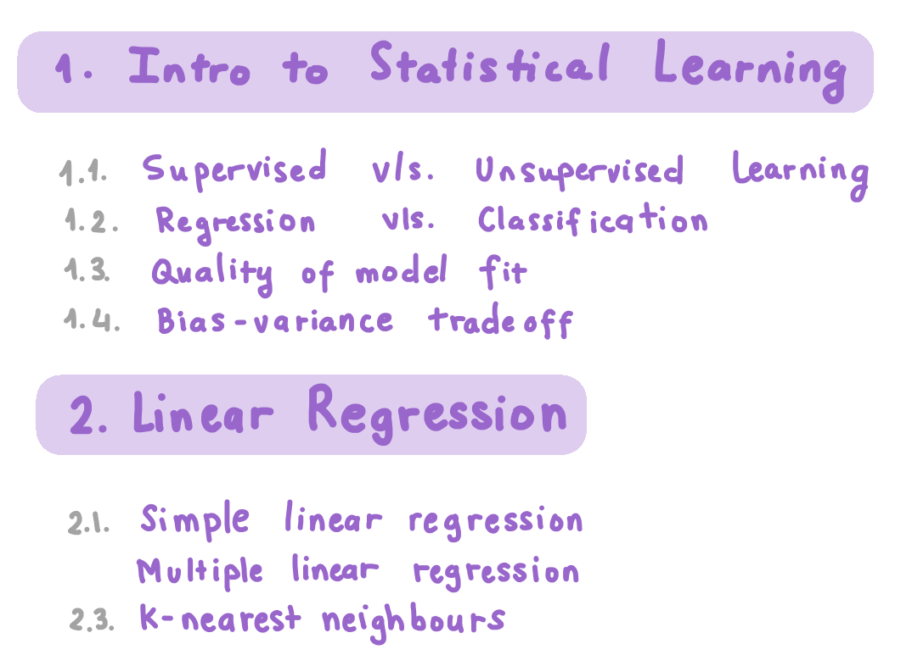
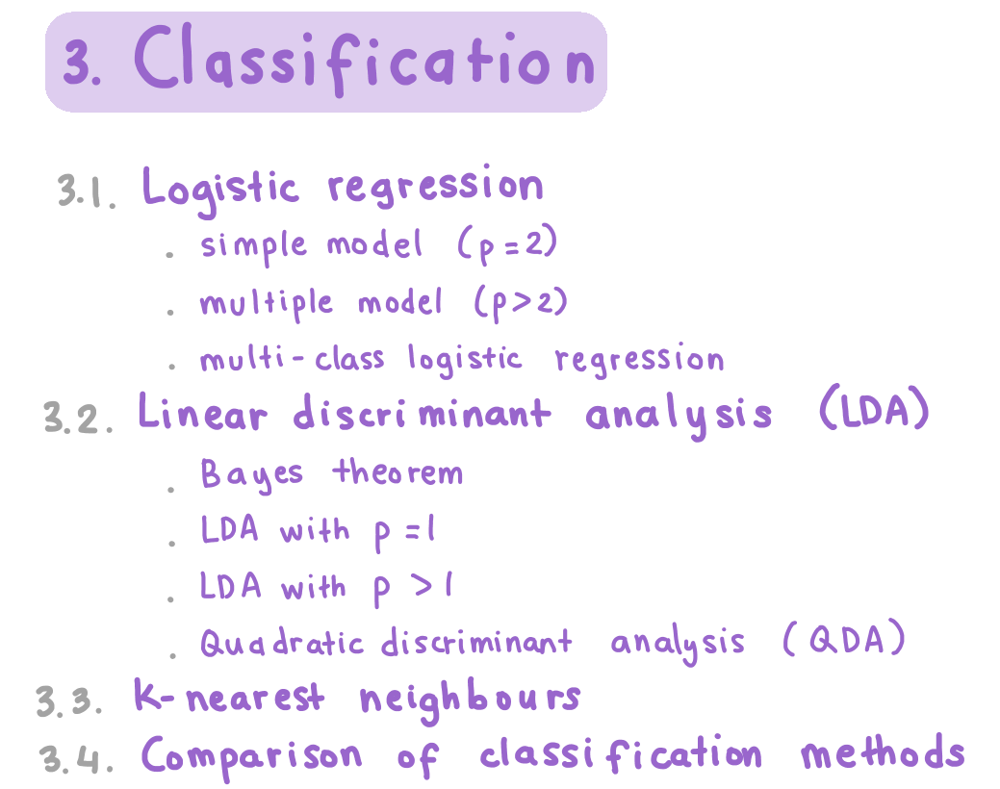
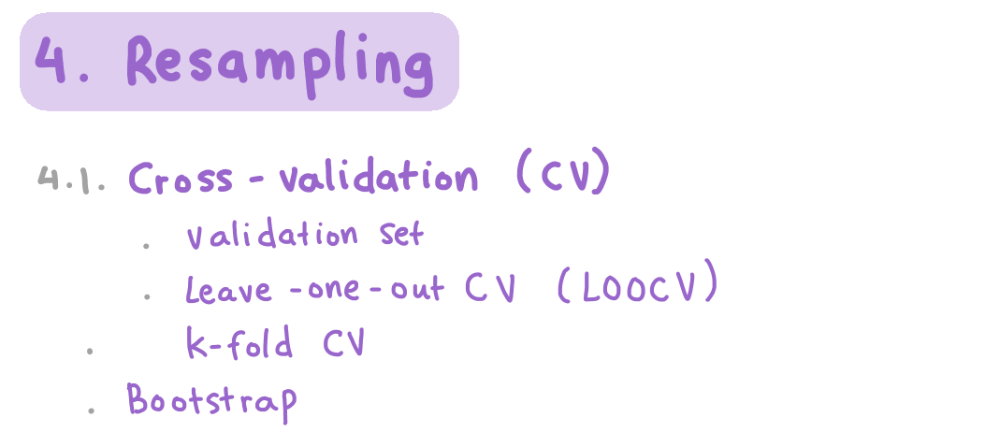
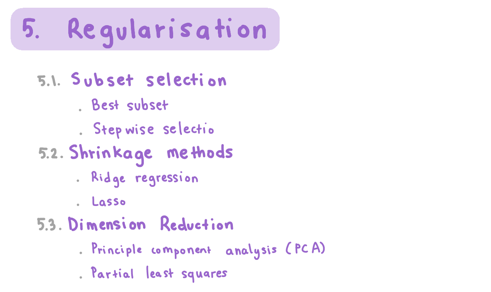
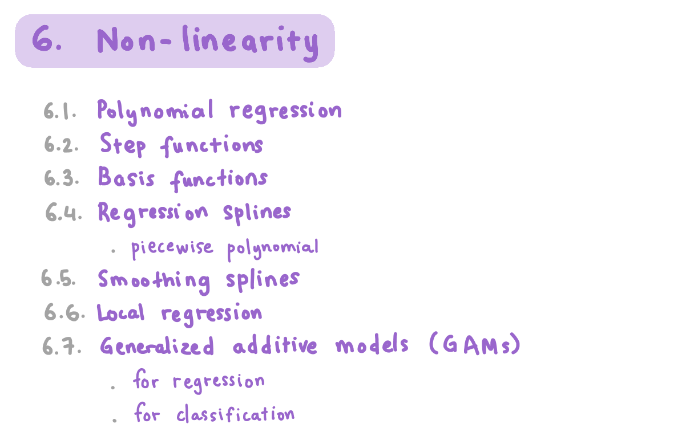
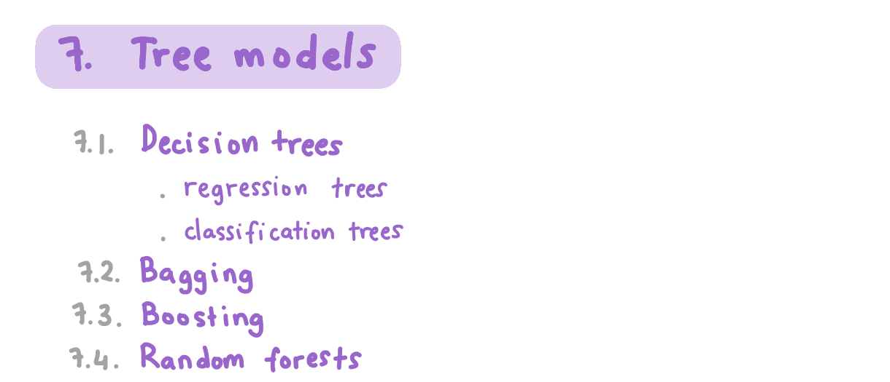
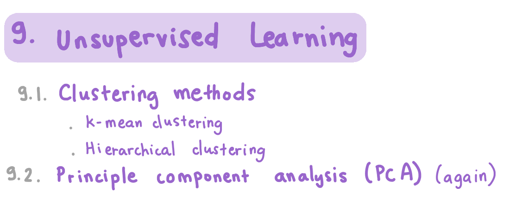

### Welcome to my Machine Learning Crash Course! 

In this series, I will attempt to explain fundamental concepts in machine learning to you in understandable terms that are also not oversimplified. 

I am definitely not an expert in the field, just a student who has really enjoyed learning about this area. My coding journey started quite late, only a bit more than half a year ago, when I entered the second semester of my first year at university. So if you are also just starting out, believe that you can and will get better at it, so long as the passion is there. 

The first post is simply just an overview of what I will be covering throughout the whole crash course. [This page](https://vas3k.com/blog/machine_learning/) has a really nice introduction to machine learning for beginners, which I would definitely you check out first. 

Machine Learning, AI, Deep Learning are oftentimes confused and used interchangeably by some people. Yet they are very different areas of study: 

Image credit: [Machine Learning for Everyone](https://vas3k.com/blog/machine_learning/)

The highlighted topics in the image above are those that I will touch on in future posts (since I have not learned about the remaining ones yet). There will also be additional topics to this crash course. You can find the full list below: 

### Credit

I owe the majority of my machine learning knowledge and the inspiration for this course mainly to two sources: 

## 1. Monash University's ETC3250: Introduction to Machine Learning: unit led by Professor Di Cook: 

* [Course website](https://iml.numbat.space/)
* [Professor Di Cook's website](http://dicook.org/)

## 2. Introduction to Statistical Learning with Applications in R: textbook written by Gareth James, Daniela Witten, Trevor Hastie and Robert Tibshirani: 

* [Link to textbook](http://faculty.marshall.usc.edu/gareth-james/ISL/)

Where necessary, I will also credit additional sources of information in my future posts. Thank you for your interest in this Machine Learning Crash Course. I hope you will find it useful in some way.
